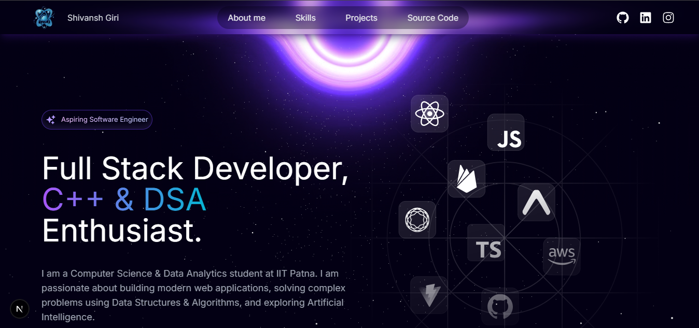
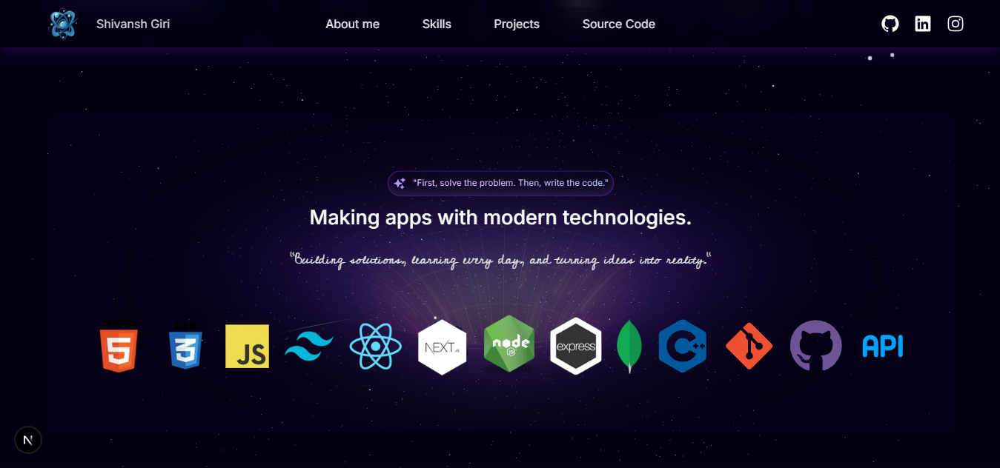
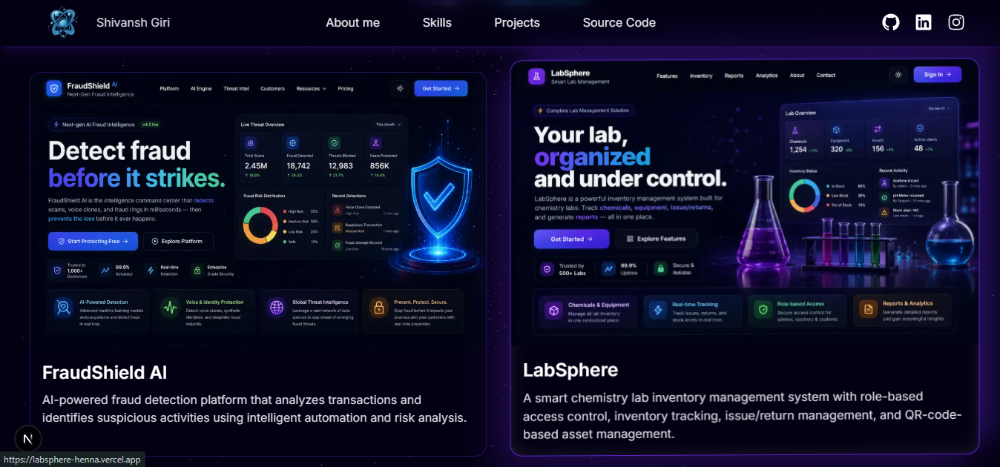
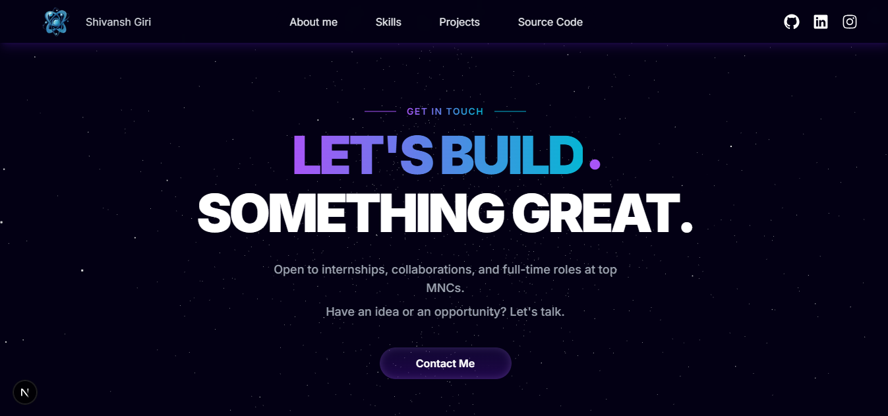

# Shivansh Giri - Developer Portfolio


Welcome to my personal developer portfolio! This project is a modern, highly interactive, and visually stunning web application built to showcase my skills, projects, and passion for software engineering. 

The portfolio features a beautiful dark space theme with custom 3D particle backgrounds, glassmorphism UI elements, and smooth scroll animations.

## 📸 Screenshots






## ✨ Key Features

- **Modern Tech Stack**: Built with Next.js 14 and React.
- **3D Interactive Backgrounds**: Uses Three.js and React Three Fiber to render a beautifully animated starfield background.
- **Fluid Animations**: Uses Framer Motion for scroll-triggered slide and fade animations.
- **Beautiful UI**: Styled with Tailwind CSS, featuring custom glassmorphic cards, glowing borders, and elegant gradients.
- **Responsive Design**: Fully mobile-responsive for all screen sizes.

## 🛠️ Tech Stack

- **Framework:** [Next.js](https://nextjs.org/)
- **Styling:** [Tailwind CSS](https://tailwindcss.com/)
- **Animations:** [Framer Motion](https://www.framer.com/motion/)
- **3D Graphics:** [Three.js](https://threejs.org/) & [@react-three/fiber](https://docs.pmnd.rs/react-three-fiber/)
- **Icons:** [Heroicons](https://heroicons.com/) & [React Icons](https://react-icons.github.io/react-icons/)

## 🚀 Getting Started

Follow these steps to run the portfolio locally on your machine:

1. **Clone the repository**
   ```bash
   git clone https://github.com/girishivansh/portfolio.git
   cd portfolio
   ```

2. **Install dependencies**
   ```bash
   npm install
   # or
   yarn install
   ```

3. **Start the development server**
   ```bash
   npm run dev
   # or
   yarn dev
   ```

4. **Open the app**
   Navigate to [http://localhost:3000](http://localhost:3000) in your browser to see the portfolio in action.

## 📫 Contact Me

- **Email**: [skgiri21102008@gmail.com](mailto:skgiri21102008@gmail.com)
- **GitHub**: [@girishivansh](https://github.com/girishivansh)
- **LinkedIn**: [Shivansh Giri](https://www.linkedin.com/in/shivanshgiri/)
- **Instagram**: [shivanshcodes](https://www.instagram.com/in/shivanshcodes/)

---
*First, solve the problem. Then, write the code.*
